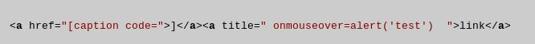

# CodePath-Week7
Gifs and Readmes associated with wordpress 4.2 vulnerabilities

Exploit 1: Authenticated Stored Cross Site Scripting

1. Steps: 
  As a contributor or author level account with page editing/posting privledges, inserted formatted HTML on a page of post. When executed by an admin, the attack continues to server-side execution. On the newly editted page, a link appears that creates an alert on mouse hover.
  
2. Type of Vulnerbility: 
  Cross Site Scripting
  
3. Affected Versions: 
  All version up to and including 4.2.2
  
4. Source Code: 

5. Gif of exploit: 
      
